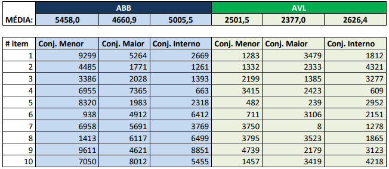
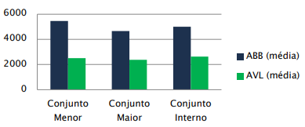

| Árvore | Itens | Média de comparações ao buscar por uma chave |
| ------ | ----- | -------------------------------------------- |
| ABB    | 10k   | 5k                                           |
| AVL    | 10k   | 15                                           |

#### Linguagem de Programação

- [x] Escolher a linguagem de programação

  

#### Geração de entrada

- [x] Escolher um valor para o  e outro para o 
- [x] Gerar um conjunto de 10 mil números aleatórios e distintos no intervalo escolhido
- [x] Criar um arquivo com nome *input.txt* contendo esses números para ser dado de entrada para o programa
- [x] Embaralhar os números

#### Experimento

- [x] Criar uma ABB

  - [ ] Gerar um conjunto menor (50 itens) composto pelos 50 primeiros números menores que o valor médio do intervalo 

    - [ ] Computar a quantidade de comparações feitas pela busca

  - [ ] Gerar um conjunto maior (50 itens) composto pelos 50 primeiros números maiores que o valor médio do intervalo 

    - [ ] Computar a quantidade de comparações feitas pela busca

  - [ ] Gerar um conjunto interno (50 itens) composto pelos 25 primeiros números e os 25 últimos números da sequência de entrada gerada no intervalo 

    - [ ] Computar a quantidade de comparações feitas pela busca

    

- [ ] Criar uma AVL

  - [ ] Gerar um conjunto menor (50 itens) composto pelos 50 primeiros números menores que o valor médio do intervalo  

    - [ ] Computar a quantidade de comparações feitas pela busca

  - [ ] Gerar um conjunto maior (50 itens) composto pelos 50 primeiros números maiores que o valor médio do intervalo  

    - [ ] Computar a quantidade de comparações feitas pela busca

  - [ ] Gerar um conjunto interno (50 itens) composto pelos 25 primeiros números e os 25 últimos números da sequência de entrada gerada no intervalo 

    - [ ] Computar a quantidade de comparações feitas pela busca

      

- [ ] Criar um arquivo com nome *search.txt* contendo os conjuntos dos experimentos para ser dado de entrada para o programa

  

#### Resultado

- [ ] Criar uma tabela com 50 linhas, referente aos 50 elementos de cada conjunto e 6 colunas referentes aos 3 conjuntos de cada árvore
  - [ ] Adicionar a quantidade de comparações ao buscar cada chave
  - [ ] Calcular a média de comparações para cada um dos conjuntos

- [ ] Criar um gráfico comparativo contendo 6 barras referentes aos 3 conjuntos de cada árvore

#### Relatório

- A entrega deve ser em um arquivo ZIP contendo:
  - [ ] Relatório em PDF com as informações de implementação
    - [ ] Linguagem utilizada
    - [ ] Você que implementou os algoritmos, ou fonte de onde foi retirado
    - [ ] Intervalo dos dados
    - [ ] A tabela
    - [ ] O gráfico
  - [ ] Dados de entrada em um arquivo com nome *input.txt* que possa ser dado de entrada para o programa
  - [ ] Dados de entrada das buscas (conjuntos dos experimentos), em um arquivo chamado search.txt, em que o programa vai receber como entrada
  - [ ] Saídas (os valores ou as médias das comparações)
  - [ ] Código-fonte do programa

#### Observações

- Quando se diz: computar a quantidade de comparações feitas pela busca, significa dizer quantas vezes comparou se é igual, se é maior ou se é menor

- O programa deverá funcionar recebendo em linha de comando os arquivos input.txt e search.txt e produzir a saída conforme já explicado
